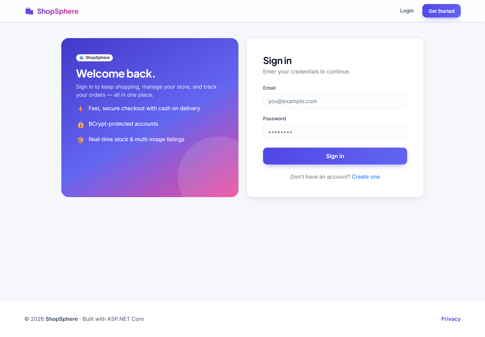
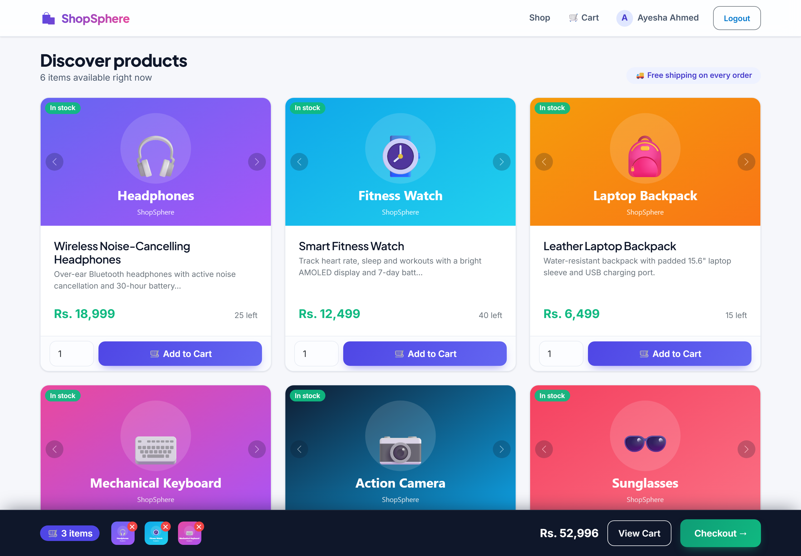
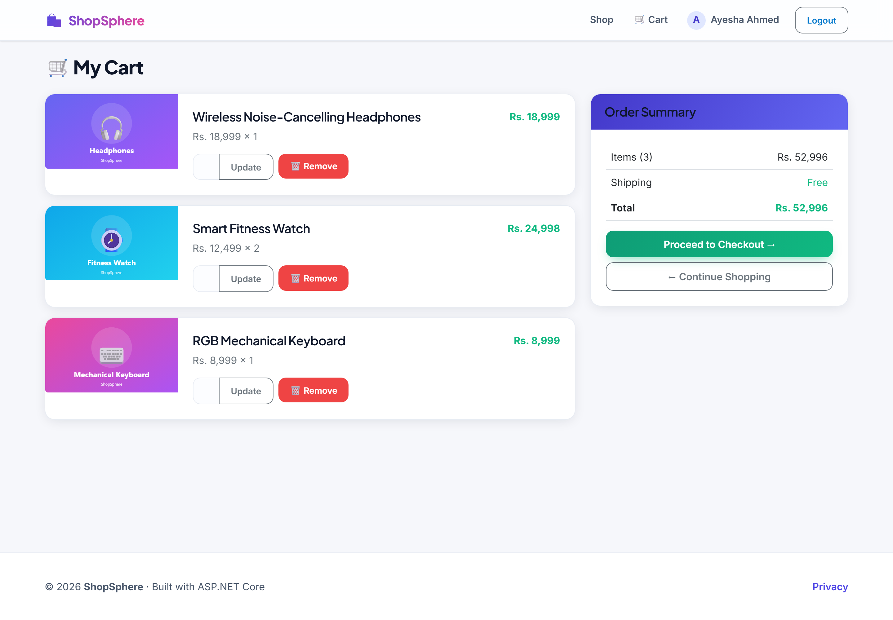
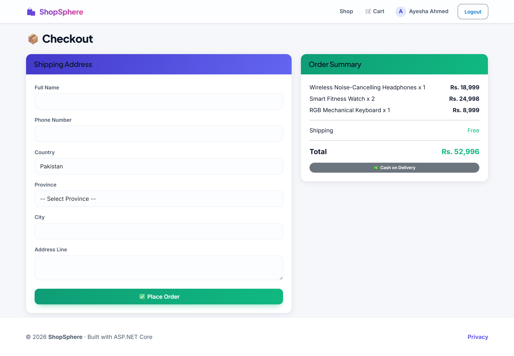
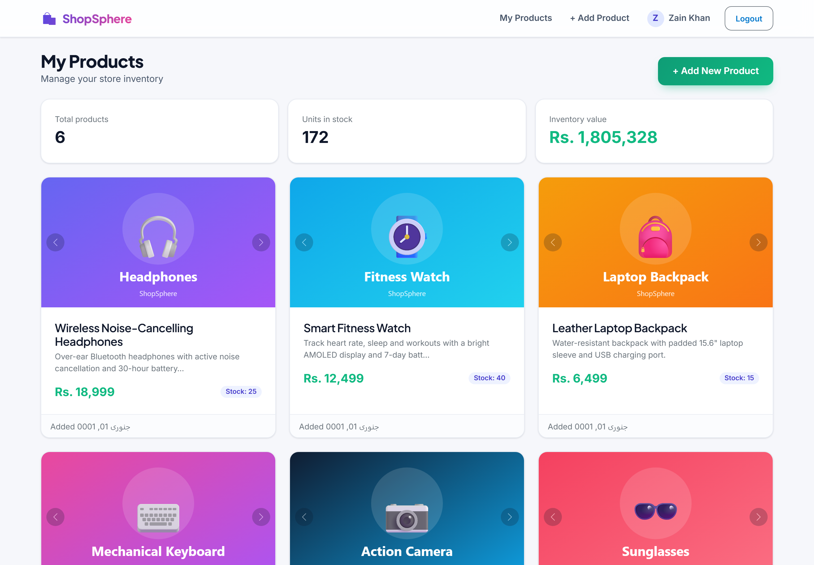
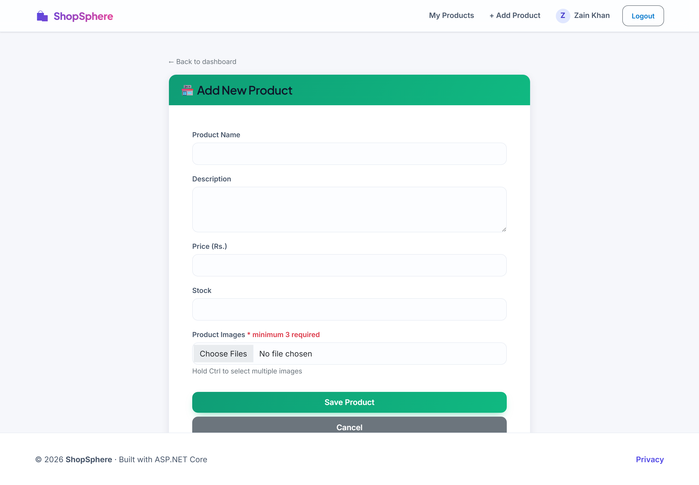
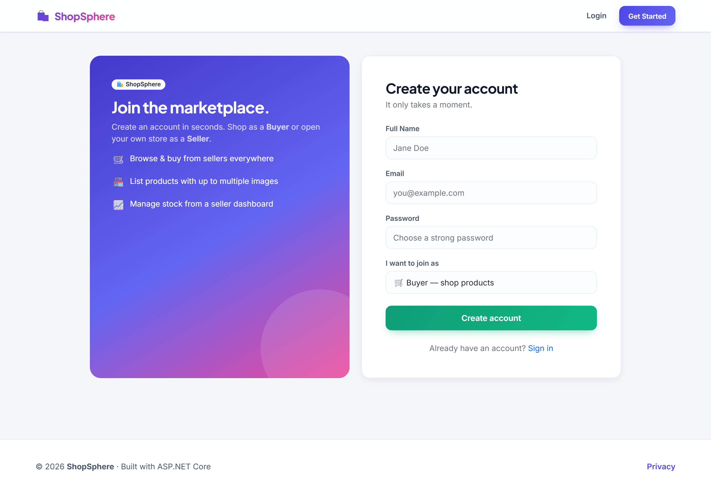
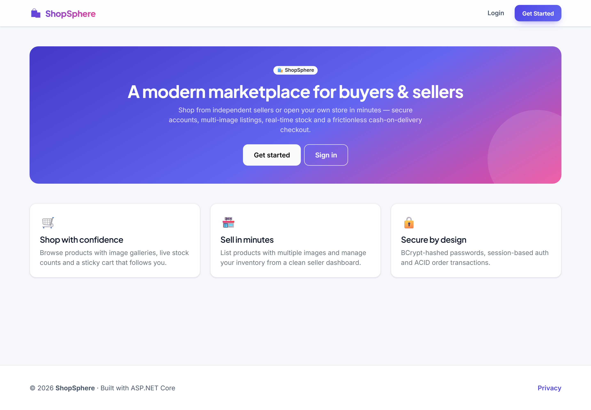
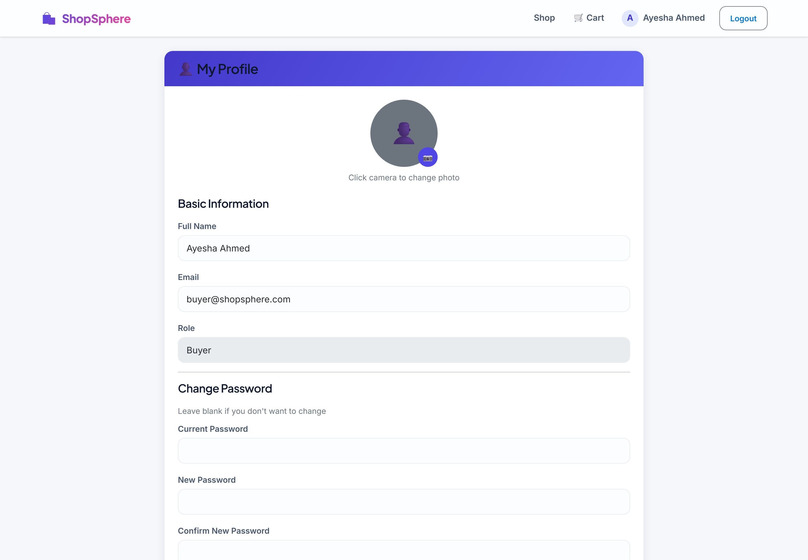

<h1 align="center">🛍️ ShopSphere</h1>

<p align="center">
  A full-stack, multi-role <strong>e-commerce marketplace</strong> built with ASP.NET Core MVC,
  a clean 3-layer architecture and raw ADO.NET — buyers shop, sellers sell, everyone wins.
</p>

<p align="center">
  
  
  
  
  
</p>

---

## ✨ Overview

ShopSphere is a marketplace where **Sellers** list products (with multi-image galleries) and
**Buyers** browse, add to cart and check out with cash-on-delivery. It demonstrates a deliberately
layered, dependency-free data stack: **Controllers → Business Logic (BLL) → Data Access (DAL)**
over raw `Microsoft.Data.SqlClient` — no ORM — with BCrypt password hashing, session-based auth,
ACID order transactions and cloud image storage on Amazon S3.

## 📸 Screenshots

| Sign in | Shop |
| --- | --- |
|  |  |

| Cart | Checkout |
| --- | --- |
|  |  |

| Seller dashboard | Add product |
| --- | --- |
|  |  |

<details>
<summary>More screens</summary>

| Register | Landing | Profile |
| --- | --- | --- |
|  |  |  |

</details>

## 🚀 Features

- **Two roles** — Buyer and Seller, with role-aware navigation and routing.
- **Authentication** — register / login with **BCrypt**-hashed passwords and server-side sessions.
- **Seller dashboard** — inventory stats (count, units, value) and per-product cards.
- **Product listings** — multi-image upload (min. 3), image carousels, live stock indicators.
- **Shopping cart** — quantity updates, stock validation, and a sticky live cart bar.
- **Checkout** — shipping address capture + **ACID** order placement (SQL transaction).
- **Profile** — edit name/email, change password, upload an avatar.
- **Cloud images** — product & profile images stored on **Amazon S3**.
- **Async everywhere** — all database calls use `async`/`await`.

## 🧱 Architecture

```
Browser ─▶ Controllers ─▶ BLL (business rules) ─▶ DAL (SqlClient) ─▶ SQL Server
                                                  └▶ S3Helper ─▶ Amazon S3
```

| Layer | Responsibility |
| --- | --- |
| **Controllers** | HTTP handling, session checks, view binding |
| **BLL** | Validation & business rules (auth, cart limits, order math) |
| **DAL** | Parameterised SQL, stored procedures, transactions |
| **Models** | Plain data classes per domain (User, Product, Cart, Order, …) |

## 🛠️ Tech stack

- **ASP.NET Core MVC** (.NET 8) · **C#**
- **Microsoft.Data.SqlClient** (raw ADO.NET — no EF)
- **SQL Server** (LocalDB for dev · Azure SQL / AWS RDS for prod)
- **BCrypt.Net-Next** · **AWSSDK.S3**
- **Bootstrap 5** + a custom design system (`wwwroot/css/site.css`)

## ⚡ Quick start (local, with LocalDB)

> Prerequisites: **.NET 8 SDK** and **SQL Server LocalDB** (ships with Visual Studio).

```bash
# 1. Create the database schema
sqlcmd -S "(localdb)\MSSQLLocalDB" -i EcommerceWeb/Database/setup.sql

# 2. (optional) seed demo products — register a Seller first so UserId = 1 exists,
#    then run:
sqlcmd -S "(localdb)\MSSQLLocalDB" -i EcommerceWeb/Database/seed-demo.sql

# 3. Run the app
cd EcommerceWeb
dotnet run
```

The default connection string in `appsettings.json` already points at LocalDB, so it runs
out of the box. Open the printed URL, register an account, and you're in.

## ⚙️ Configuration

All secrets live in configuration — **nothing is hard-coded in source**. Override the defaults
in `appsettings.json` for production, or keep them out of the repo entirely with
[user-secrets](https://learn.microsoft.com/aspnet/core/security/app-secrets) / environment variables:

```jsonc
{
  "ConnectionStrings": {
    "DefaultConnection": "Server=...;Database=EcommerceDB;User Id=...;Password=...;TrustServerCertificate=True;"
  },
  "AWS": {
    "AccessKey": "...",
    "SecretKey": "...",
    "BucketName": "your-bucket",
    "Region": "us-east-1"
  }
}
```

```bash
# Example: keep AWS keys out of the repo
dotnet user-secrets set "AWS:AccessKey" "AKIA..."
dotnet user-secrets set "AWS:SecretKey" "..."
```

> Image upload requires valid AWS S3 credentials. Without them the app runs fine — product/profile
> images simply won't upload (browsing, cart and checkout work normally).

## 🗄️ Database

The full schema (tables, stored procedures, a table-valued function and a stock-guard trigger)
is in [`EcommerceWeb/Database/setup.sql`](EcommerceWeb/Database/setup.sql). Core tables:

`Users` · `Products` · `ProductImages` · `Cart` · `Orders` · `OrderDetails` · `ShippingAddress`

## 📂 Project structure

```
EcommerceWeb/
├── Controllers/        # Auth, Product, Cart, Order, Profile, Home
├── BLL/                # Auth, Product, Cart, Order business logic
├── DAL/                # SqlClient data access + DbHelper, S3Helper
├── Models/             # Domain models (User, Product, Cart, Order, …)
├── Views/              # Razor views + shared layout
├── Database/           # setup.sql, seed-demo.sql
└── wwwroot/            # CSS design system, JS, static images
```

## 🧭 Roadmap ideas

- Product search & category filters
- Buyer order history & seller sales analytics
- Payment gateway integration
- Wishlist & product reviews

---

<p align="center"><em>Built as a portfolio project to showcase layered ASP.NET Core architecture.</em></p>
